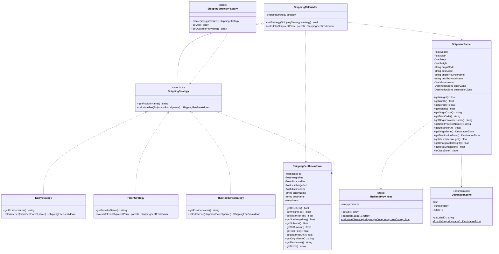

# 📦 พิมพ์เขียวระบบคำนวณค่าจัดส่งพัสดุ (Smart Shipping Calculator)
> **Architecture**: **MVC (Model - View - Controller)**  
> **Core Design Pattern**: **Strategy Pattern** (หัวใจหลักตามโจทย์: สลับสูตรคำนวณตามผู้ให้บริการขนส่ง)  
> **Tech Stack**: PHP 8.2+, Tailwind CSS, HTML5, Vanilla JS, Canvas Confetti  
> **Target Folder**: `C:\xampp\htdocs\shipping-calculator`  
> **Version**: 4.0 (Full MVC Separation & 1 Core Design Pattern)

---

## 📁 โครงสร้างโฟลเดอร์แบบ MVC (MVC Directory Structure)
```text
shipping-calculator/
├── controllers/
│   └── ShippingController.php      # [C] Controller รับ Request และควบคุม Flow การทำงาน
├── models/                         # [M] Model ข้อมูลและ Business Logic ทั้งหมด
│   ├── ShippingStrategy.php        # Core Strategy Interface
│   ├── KerryStrategy.php           # Concrete Strategy 1: Kerry Express
│   ├── FlashStrategy.php           # Concrete Strategy 2: Flash Express
│   ├── ThaiPostEmsStrategy.php     # Concrete Strategy 3: ไปรษณีย์ไทย EMS
│   ├── ShippingStrategyFactory.php # ตัวช่วยเรียกใช้งาน Strategy
│   ├── ShipmentParcel.php          # DTO / Entity พัสดุและเส้นทาง
│   ├── ShippingCalculator.php      # Context คลาสคำนวณ
│   ├── ShippingFeeBreakdown.php    # สรุปแจกแจงค่าบริการและ VAT
│   ├── ThailandProvinces.php       # ฐานข้อมูลพิกัด 77 จังหวัดและคำนวณระยะทาง
│   └── DestinationZone.php         # Enum โซนพื้นที่
├── views/
│   └── calculator.php              # [V] View หน้าจอ UI / UX แสดงผลทั้งหมด
├── index.php                       # Front Controller (Entry Point เรียก Controller)
└── BLUEPRINT.md                    # เอกสารสถาปัตยกรรมระบบ
```


## 🎯 1. วัตถุประสงค์และกระบวนการทำงาน (3-Step Logistics Funnel v3.1)
พัฒนาระบบตามมาตรฐานโลจิสติกส์สากล ตอบสนองความต้องการจริงของผู้ใช้:
1. **Step 1: กำหนดพัสดุและเส้นทาง 77 จังหวัด (77 Provinces & Parcel Specs)**:
   - เลือกจังหวัดต้นทางและปลายทางจากฐานข้อมูล **77 จังหวัดทั่วไทย**
   - คำนวณ **ระยะทางขับรถจริงโดยประมาณ (กม.)** ด้วยสูตร Haversine + ปัจจัยถนนจริงในไทย ($\times 1.25$) (เช่น กรุงเทพฯ ➔ อุทัยธานี = ~235 กม.)
   - ตรวจจับพื้นที่ห่างไกล/เกาะ/ชายแดนใต้โดยอัตโนมัติ
   - รับน้ำหนักชั่งจริง และมิติกล่อง ($W \times L \times H$) เพื่อคิด **Chargeable Weight** ตามมาตรฐานสากล
2. **Strict Step Guard (ระบบป้องกันการข้ามขั้นตอน)**:
   - แท็บขั้นตอนที่ 2 และ 3 จะถูกล็อค (🔒) ไว้ตามค่าเริ่มต้น ผู้ใช้ไม่สามารถคลิกข้ามได้จนกว่าจะกดยืนยันข้อมูลในขั้นตอนที่ 1
   - เมื่อเลือกบริษัทขนส่งในขั้นตอนที่ 2 จึงจะปลดล็อคขั้นตอนที่ 3 เพื่อป้องกันการเปิดหน้าใบเสร็จว่างเปล่า
3. **Step 2: เปรียบเทียบและเลือกขนส่ง (Compare & Select)**:
   - คำนวณราคาขนส่ง 3 แบรนด์หลัก (Kerry Express, Flash Express, ไปรษณีย์ไทย EMS) อิงตามระยะทางและน้ำหนักจริง
   - มีป้ายไฮไลต์เจ้าที่ประหยัดที่สุด (★ ถูกที่สุด)
4. **Step 3: ใบแจกแจงค่าบริการมาตรฐานพาณิชย์ (Itemized Logistics Tax Invoice)**:
   - เลขที่ใบประเมิน (Reference ID), วันที่และเวลาประเมิน
   - รายละเอียดเส้นทางและระยะทางจริง (กม.), ขนาดพัสดุ และน้ำหนักคิดเงิน
   - รายการแจกแจงค่าบริการ: ค่าบริการเริ่มต้น, ค่าน้ำหนักส่วนเกิน, ค่าขนส่งตามระยะทางจริง, ค่าพื้นที่พิเศษ
   - ยอดรวมก่อนภาษี (Subtotal), ภาษีมูลค่าเพิ่ม VAT 7%, และยอดสุทธิ (Grand Total)
   - ฟังก์ชันพิมพ์ใบเสร็จ (Print Invoice) และปุ่มคัดลอกสรุปรายการ (Copy Summary)

---

## 🏗️ 2. สถาปัตยกรรมระบบและไดอะแกรม (UML Class Diagram)



---

## 🧮 3. สูตรคำนวณระยะทางขับรถจริง (Haversine + Road Winding Factor)
```php
$straightDistance = 2 * asin(sqrt(sin($latDelta / 2)^2 + cos($lat1) * cos($lat2) * sin($lonDelta / 2)^2)) * 6371;
$roadDistance = round(max(20.0, $straightDistance * 1.25), 0);
```
- **ตัวอย่าง**: กรุงเทพมหานคร (`TH-10`) ➔ อุทัยธานี (`TH-61`)
  - Straight line: ~188.13 กม.
  - Road distance factor ($\times 1.25$): **~235 กม.** (สอดคล้องกับเส้นทางถนนสายเอเชีย ทล.32)

---

## 🛡️ 4. กฎและ Guard Clauses
1. **Strict Step Guard**:
   - `Step 2`: ปลดล็อคเมื่อผู้ใช้กดยืนยัน Step 1
   - `Step 3`: ปลดล็อคเมื่อผู้ใช้เลือกขนส่งใน Step 2
   - ป้องกันการคลิกแท็บข้ามไป Step 3 โดยยังไม่มีข้อมูล
2. **Validation Guard ใน ShippingCalculator**:
   - น้ำหนักจริงต้องอยู่ระหว่าง $0.01$ ถึง $100.00$ กก.
   - ด้านกว้าง, ยาว, สูง ต้องอยู่ระหว่าง $0.1$ ถึง $250.0$ ซม.
   - ขนาดรวม 3 ด้าน ($W+L+H$) ต้องไม่เกิน $400$ ซม.